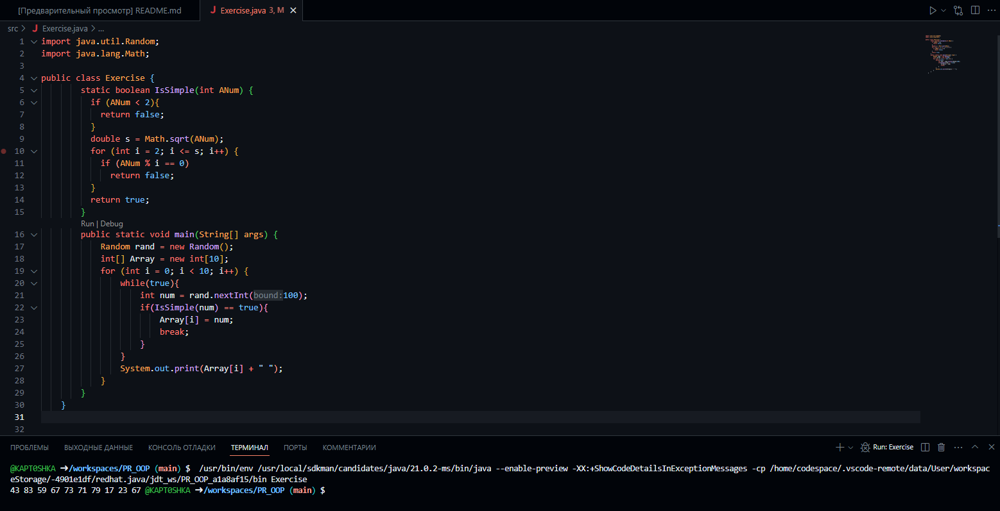
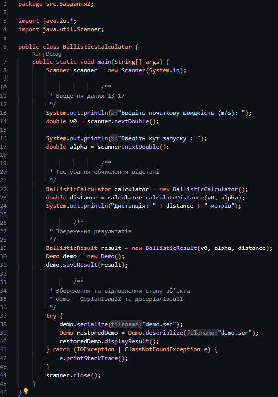
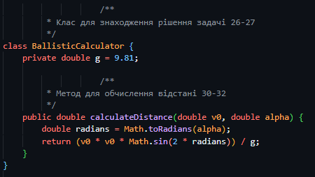
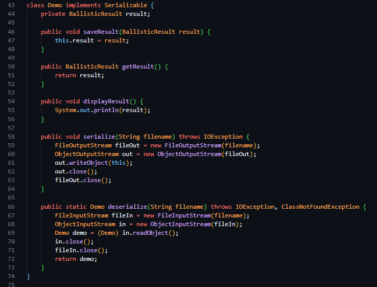
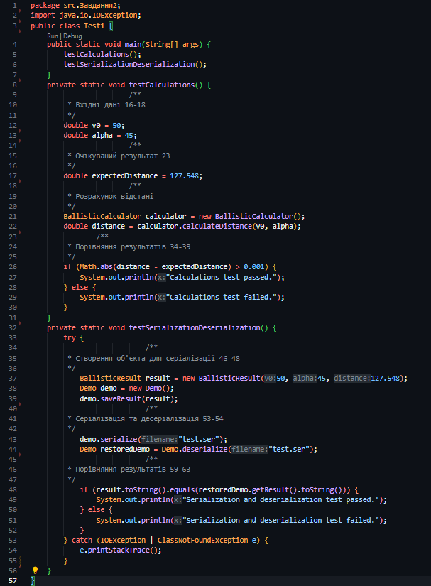
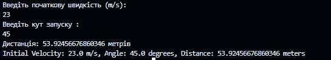

Шоно Ростислав, 34 група (2 підгрупа)

## ЗАВДАННЯ 1

Написати просту консольну програму

## ЗАВДАННЯ 2

Визначити в англійській та метричній системі заходів значення дальності
польоту (s = v0 * v0 * sin(2 * α) / g) по балістичній траєкторії із заданою
початковою швидкістю v0 та кутом α до поверхні Землі.

Розробити клас, що серіалізується, для зберігання параметрів і результатів
обчислень.

Використовуючи агрегування, розробити клас для знаходження рішення
задачі.

Розробити клас для демонстрації в діалоговому режимі збереження та
відновлення стану об'єкта, використовуючи серіалізацію. Показати особливості
використання transient полів.

Розробити клас для тестування коректності результатів обчислень та
серіалізації/десеріалізації.

Результат:

